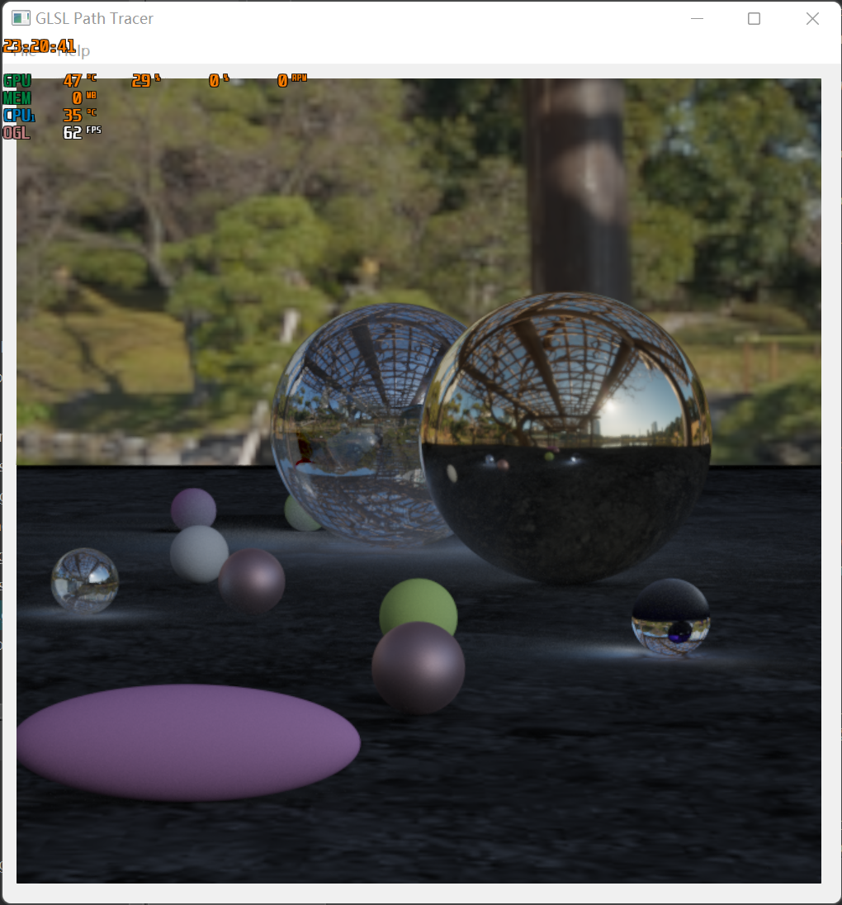
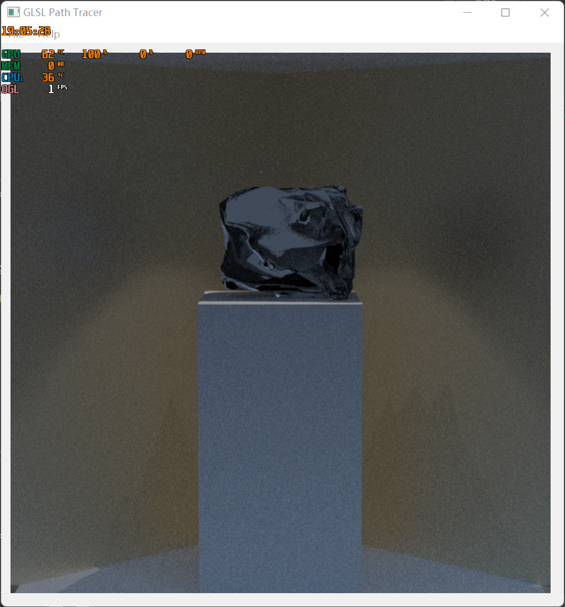
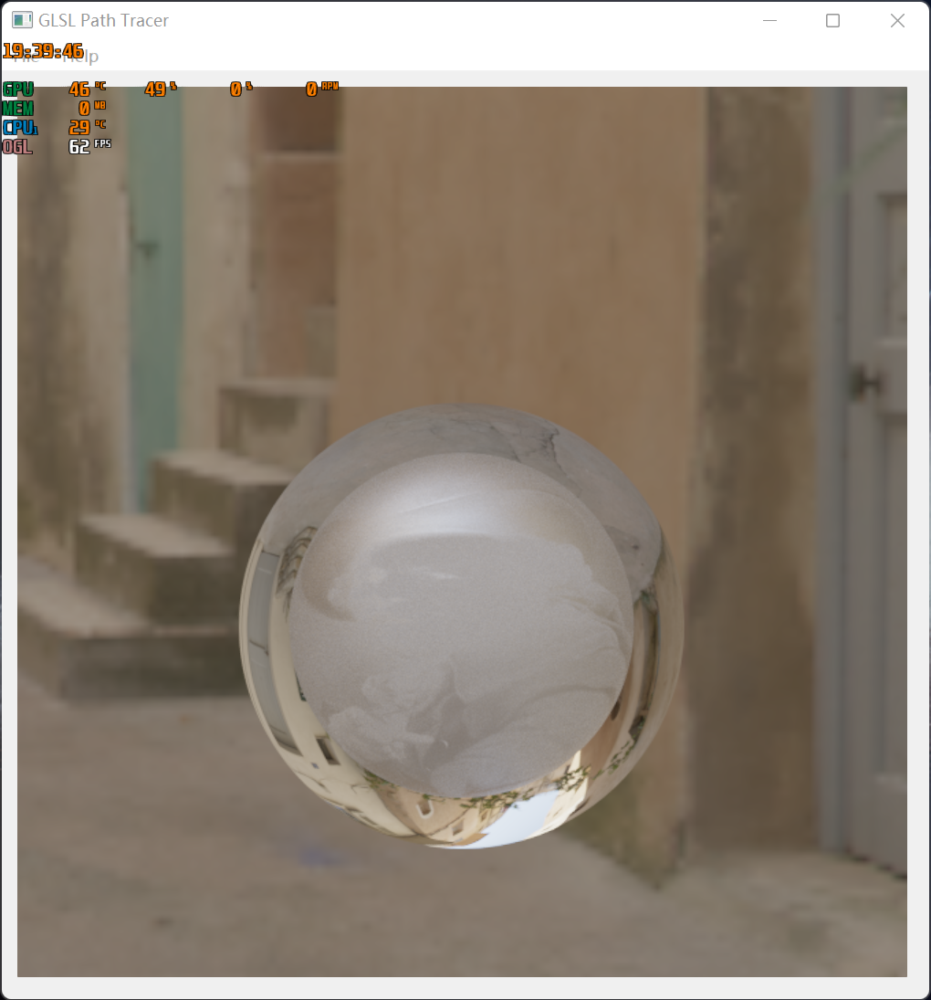

**University of Pennsylvania, Monte Carlo Path Tracer**

* Yilin Li

## Introduction 
This project implements a Monte Carlo Path Tracer with different BxDFs and lightings.

Some customized scenes are shown below:

